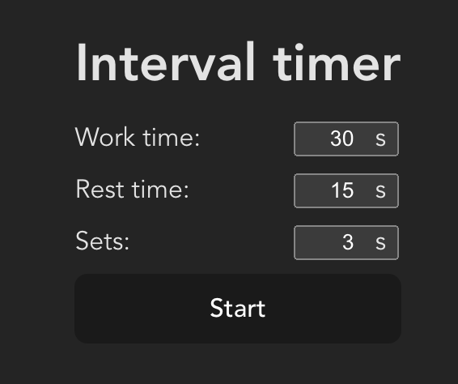
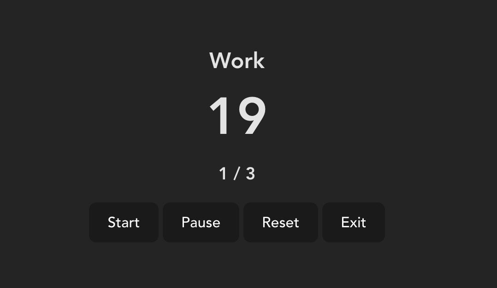
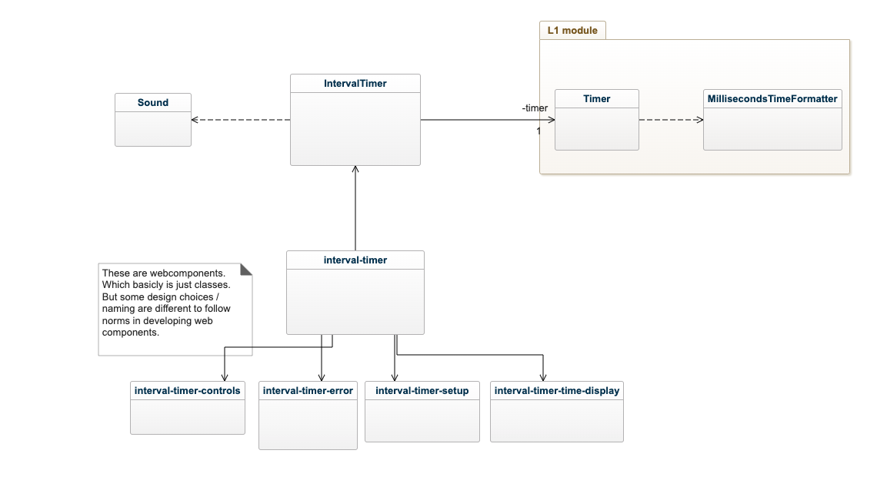

# LAB 2 - Interval Timer - For Developers

## Vision

Tick-Tock Interval Timer app let the user define a working timer followed by a resting timer. These intervals can then by multiplied in forms of sets. Upon start and end of a working session the user is notified visually and by sound. The application is presented as a web app with a simplistic and minimalistic user interface.

To set up a new timer the user defines a working time, resting time and how many times they should repeat, i.e. sets.

## Requirements

The application is defined by the following functional requirements:

1. As a user I want to be able to define a working time, resting time and amount of sets on intial page load.
2. As a user I want to be able to start the interval timer after entering a working time, resting time and amount of sets.
3. As a user I want to, after starting the interval timer, be presented with a countdown timer and the name of the current interval.
4. As a user I want to be able to pause/resume and reset a started interval timer.
5. As a user I want to be able to exit from a started interval timer and be able to define a new.
6. As a user I want to be notified when an interval ends by sound.
7. As a user I want the interval timer to expire after the last working interval.

## Test specification

Testing is performed via manual testing.

### Test cases

| Test case | What is tested | Input                                                                    | Output                                                                                                                                  |
| --------- | -------------- | ------------------------------------------------------------------------ | --------------------------------------------------------------------------------------------------------------------------------------- |
| 1         | Req 1.         | Start the application by following the instruction in README             |                                                                                                      |
| 2         | Req 2. Req 3.  | Requires TC 1. Enter work time 20, rest time 10 and sets 3. Press start. | Timer should start countdown from 20. "Work" is diplayed above timer.                        |
| 3         | Req 3. Req 6.  | Requires TC 2. Wait 20 seconds.                                          | After 20 seconds the time should make a sound and init the rest countdown. Counting down from 10 and displaying "Rest" above the timer. |
| 4         | Req 4.         | Requires TC 2. Press "Pause"                                             | The timer should pause its countdown                                                                                                    |
| 5         | Req 4.         | Requires TC 4. Press "Start".                                            | The timer should start from where it was paused.                                                                                        |
| 6         | Req 4.         | Requires TC 5. Press "Reset".                                            | The timer should reset and now display 20.                                                                                              |
| 7         | Req 4.         | Requires TC 6. Press "Start".                                            | The timer should start counting down from 20.                                                                                           |
| 8         | Req 5.         | Requires TC 7. Press "Exit".                                             | The timer should disappear and the inital view shown. Like Testcase 1 output.                                                           |
| 9         | Req 5.         | Requires TC 8. Enter work time 30, rest time 20 and sets 5. Press start. | Timer should start countdown from 30.                                                                                                   |
| 10        | Req 7.         | Requires TC 2. Wait until the final third working interval reaches 0.    | The timer should read 0 and display "Finished" above it.                                                                                |

### Testreports

Date: 18/10-22
Version: git SHA number 52cdd39990930319a7036de94b0c10ea814d8744

| Test case    | Result | Notes |
| ------------ | ------ | ----- |
| Test case 1  | PASS   |       |
| Test case 2  | PASS   |       |
| Test case 3  | PASS   |       |
| Test case 4  | PASS   |       |
| Test case 5  | PASS   |       |
| Test case 6  | PASS   |       |
| Test case 7  | PASS   |       |
| Test case 8  | PASS   |       |
| Test case 9  | PASS   |       |
| Test case 10 | PASS   |       |

## Design

_A picture says more than a thousand words!_ :wink:

## Further improvments

- Custom intervals. Be able to add more than 2 intervalls in a set.
- Display diffrent colors of background depending on interval state.
- Custom colors and notification sounds.
- Create mobile / PWA version to be able to run in the background.
