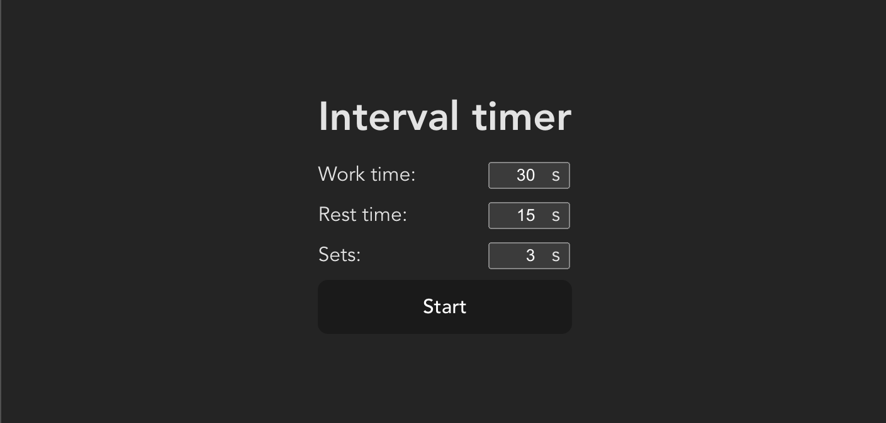
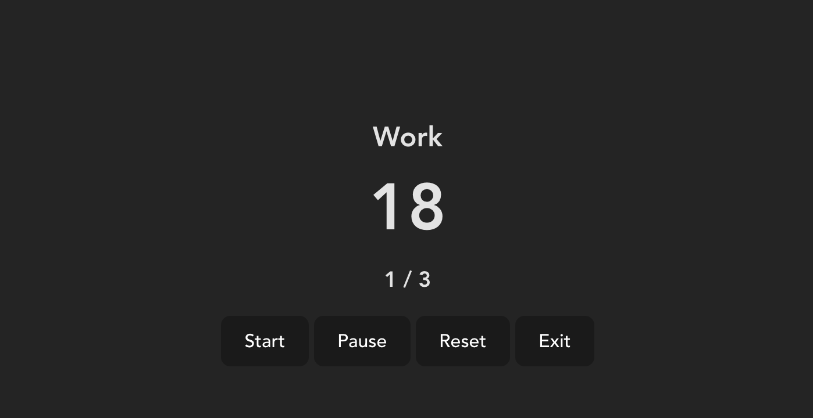

# Lab 2 - Interval Timer

> This readme contains information about the application and how to use it. Information for developers (requirements, testing, etc) is found in the [DEVELOPER.md](./DEVELOPER.md). Reflection of the assignment is found in [REFLECTION.md](./REFLECTION.md).

> My module is installed via npm. The module repo is found [here](https://github.com/eric-sundquist/tick-tock-timer)

## Description

Interval Timer let you define a working timer followed by a resting timer. These intervals can then by multiplied in forms of sets. You will get notified as a new interval beginns on screen and by sound.

Example of use:

- Training intervals, define training time followed by rest.
- Study timer, use for example the pomodoro technique.

## Try the application locally

1. Clone the repository
2. Go to directory, `cd lab-2`
3. Install dev dependencies, `npm i`
4. Start dev server, `npm run dev`
5. Use app

## Basic usage

1. Define a new timer by entering the work and rest times and how many times they should be repeated.
2. Press start.
3. Timer has now started.

#### Controlls

- _Start_: If timer has been paused it can be started again via this button.
- _Pause_: Pauses the timer.
- _Reset_: Resets the timer to the intial set values.
- _Exit_: Stops the timer and let you define a new.

## Publish app

When publishing the app to a real server. Build the application using `npm run build`. It will create a `dist` folder in the root of the repo which you then publish to the server.

## Licens

MIT License, (See adjacent LICENSE file)
